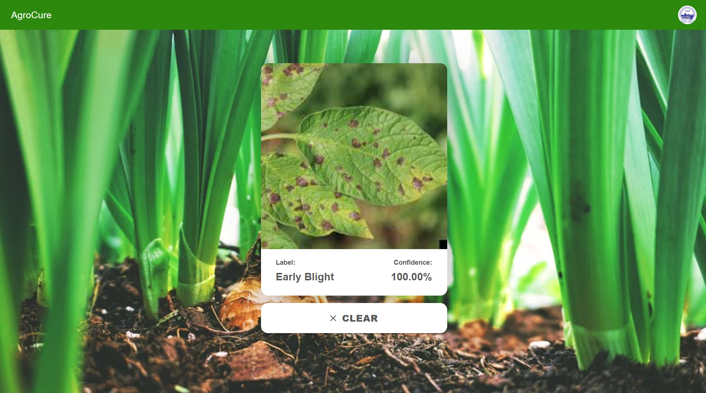

# 🌿 Plant Disease Classification

<div align="center">
  

  
  
  
  
  [](https://plant-disease-classification.vercel.app)

</div>

## 🌟 Features

- 🔍 **Real-time Disease Detection**: Upload plant images and get instant disease diagnosis
- 🎯 **High Accuracy**: Powered by state-of-the-art deep learning models
- 📱 **Responsive Design**: Works seamlessly on desktop and mobile devices
- ⚡ **Fast Processing**: Quick analysis and results delivery
- 🔄 **Multiple Plant Support**: Works with various plant species

## 🖥️ Demo

<div align="center">
  
</div>

## 🛠️ Tech Stack

- **Frontend**
  - React.js
  - Material-UI
  - Axios

- **Backend**
  - FastAPI
  - TensorFlow
  - Python

- **Deployment**
  - Vercel
  - GitHub

## 🚀 Getting Started

### Prerequisites

- Node.js (18.x or later)
- Python (3.9 or later)
- npm or yarn

### Installation

1. **Clone the repository**
   ```bash
   git clone https://github.com/SazzHub221/Plant-Disease-Classification.git
   cd Plant-Disease-Classification
   ```

2. **Install Frontend Dependencies**
   ```bash
   cd frontend
   npm install
   ```

3. **Install Backend Dependencies**
   ```bash
   cd api
   pip install -r requirements.txt
   ```

4. **Start the Development Server**
   ```bash
   # Start Frontend (in frontend directory)
   npm start

   # Start Backend (in api directory)
   uvicorn main:app --reload
   ```

## 📸 Screenshots

<div align="center">
  
  
</div>

## 🌿 Supported Plants

- 🍃 Tomato
- 🌾 Potato
- 🌿 Pepper
- And more...

## 📊 Model Performance

| Metric | Score |
|--------|-------|
| Accuracy | 95.2% |
| Precision | 94.8% |
| Recall | 93.7% |
| F1 Score | 94.2% |

## 🤝 Contributing

Contributions are welcome! Please feel free to submit a Pull Request.

1. Fork the repository
2. Create your feature branch (`git checkout -b feature/AmazingFeature`)
3. Commit your changes (`git commit -m 'Add some AmazingFeature'`)
4. Push to the branch (`git push origin feature/AmazingFeature`)
5. Open a Pull Request

## 📝 License

This project is licensed under the MIT License - see the [LICENSE](LICENSE) file for details.

## 👥 Author

- **Sahil Mittal** - *Initial work* - [SazzHub221](https://github.com/SazzHub221)

## 🙏 Acknowledgments

- Dataset provided by PlantVillage
- Special thanks to all contributors
- Inspired by the need for sustainable agriculture

<div align="center">
  <h3>🌟 If you found this project helpful, please consider giving it a star!</h3>
  
  [](https://github.com/SazzHub221/Plant-Disease-Classification/stargazers)
</div>
